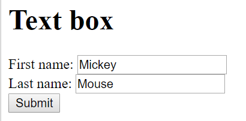
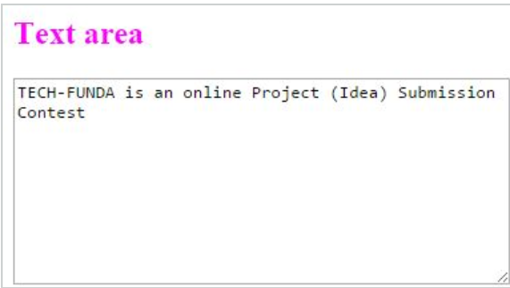
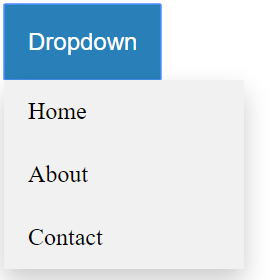
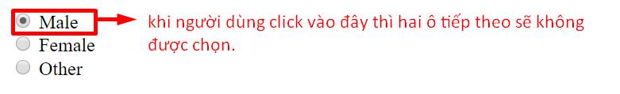
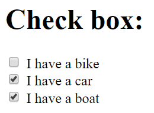
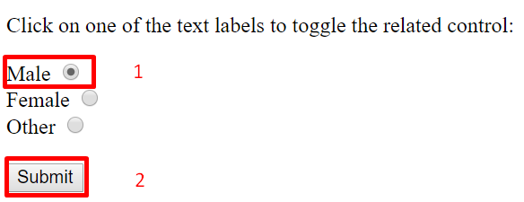
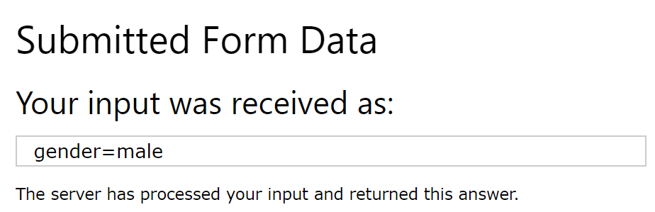
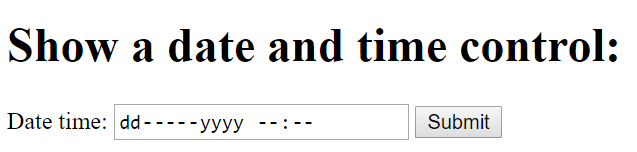

# Các kiểu dữ liệu

## Mục lục 
[1. Text box](#textbox)

[2. Text area](#area)

[3. Dropdown list](#dropdown)

[4. Radio Button](#radio)

[5. Check box](#check)

[6. Label](#label)

[7. Date time](#dt)

### 1. Text box 
Sử dụng cho nhập dữ liệu đầu vào cho đầu vào dạng văn bản (một dòng).

### 2. Text Area(vùng dữ liệu)

Nó xác định nhiều dòng để xác định đầu vào, Nó xác định với các hàng và cột.

### 3. Dropdown list(danh sách thả xuống)

Menu thả xuống là một menu có thể bật cho phép người dùng chọn một giá trị từ danh sách được xác định trước.

### 4. Radio button

Khi người dùng nhấp vào nút radio, nó sẽ được chọn và tất cả các nút radio khác có cùng tên sẽ không được chọn.

### 5. Check box 

Cho phép người dùng chọn một hoặc nhiều tùy chọn trong số lượng lựa chọn giới hạn.

### 6. Label 

 Không hiển thị bất cứ gì đặc biệt cho người dùng, tuy nhiên nó cung cấp một cải thiện cho người sử dụng chuột, nếu click chuột vào nhãn, sẽ đưa con trỏ chuột vào vùng. 
 
 *Ví dụ:* 
 Khi click vào nút `Male `sau đó nhấn vào nút `Submit`

 

 Giao diện sẽ đưa người dùng đến vùng các thông tin chi tiết của Male.

 

### 7. Date time 

Giá trị kết quả bao gồm năm, tháng, ngày và thời gian.

### Tài liệu tham khảo: 

https://viblo.asia/p/cac-truong-hop-test-co-ban-4P856av9lY3

https://www.w3schools.com/tags/att_input_type_radio.asp

