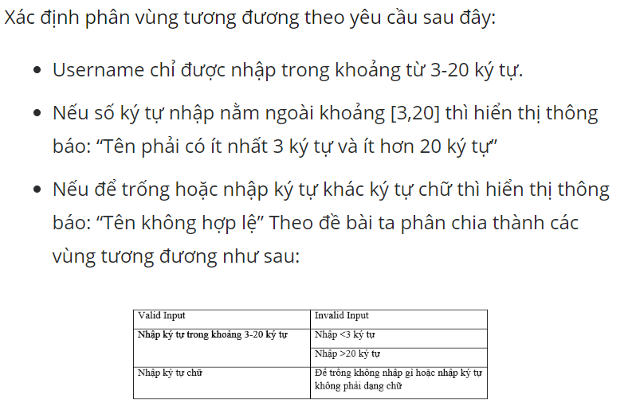
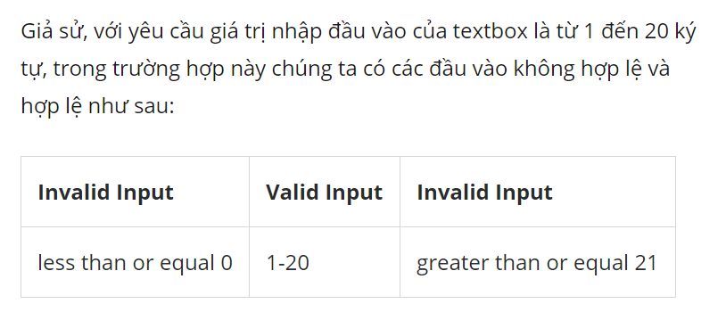
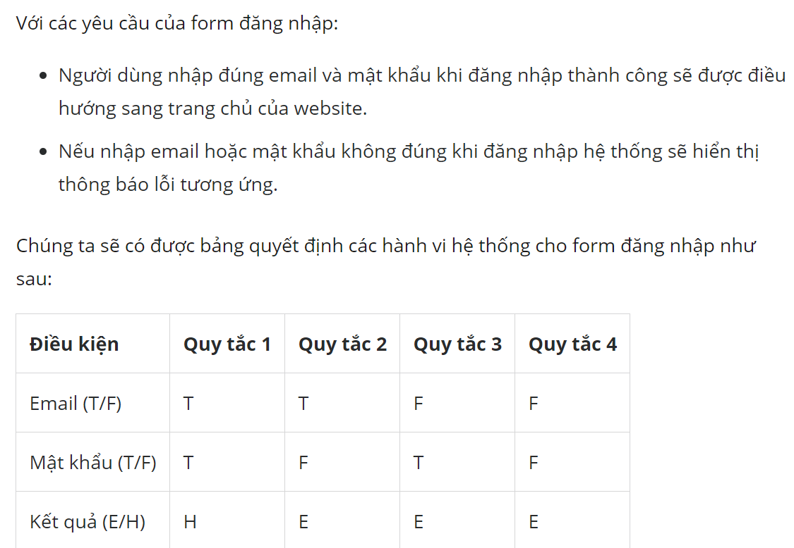
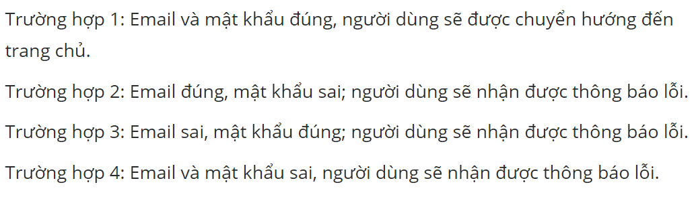

# Các kỹ thuật kiểm thử hộp đen.

## Mục lục.

[1. Khái niệm kiểm thử hộp đen](#khainiem)

[2. Phân vùng tương đương](#tuongduong)

[3. Phân tích giá trị biên](#giatribien)

[4. Bảng quyết định](#bang)

### 1. Khái niệm. 

Kiểm thử hộp đen (Black Box Testing) là phương pháp kiểm thử phần mềm được sử dụng để kiểm tra phần mềm mà không biết cấu trúc nội bộ của mã hoặc chương trình. 
- Mục đích: kiểm tra xem phần mềm có hoạt động như mong đợi trong tài liệu yêu cầu hay không và có đáp ứng được kỳ vọng của khách hàng không?
- Các loại kỹ thuật kiểm thử hộp đen: 
    - Phân vùng tương đương(Equivalence Partition)
    - Phân vùng giá trị biên (Boundary Value Analysis)
    - Bảng quyết định(Decision Table)
    - Đoán lỗi (Error Guessing)

### 2. Phân vùng tương đương.

   Chia miền đầu vào của một chương trình thành các lớp dữ liệu từ đó suy dẫn ra các ca kiểm thử. Biểu thị một tập cho các trạng thái hợp lệ hay không hợp lệ.

- Xác định các lớp tương đương.

    - Vùng hợp lệ 
    - Vùng không hợp lệ.

- Xác định các ca kiểm thử.

*Ví dụ minh họa*

### 3. Phân tích giá trị biên. 

Là một kỹ thuật thiết kế trường hợp thử nghiệm để kiểm tra **ranh giới** giữa các phân vùng(hợp lệ và không hợp lệ). Thay vì chọn nhiều giá trị trong vùng tương đương thì chọn các giá trị biên để test. Phân tích giá trị biên là phương pháp thiết kế ca kiểm thử bổ sung thêm cho phân lớp tương đương.

Nguyên tắc chọn giá trị biên: 

- Giá trị nhỏ nhất.(min)
- Giá trị ngay dưới giá trị nhỏ nhất.(min-1)
- Giá trị trung bình.(min+max/2)
- Giá trị lớn nhất.(max)
- Giá trị ngay trên giá trị lớn nhất.(max+1)

**Lưu ý**

*Ví dụ minh họa*

*Tại sao cần kiểm thử giá trị biên và phân vùng tương đương?*

- Giảm số lượng lớn các test case được phân chia có thể quản lý được. 
- Hướng dẫn rõ ràng về việc xác định các test case mà không ảnh hưởng đến hiệu quả của kiểm thử. 

### 4. Bảng quyết định.

Bảng quyết định là một kỹ thuật test được sử dụng để kiểm tra các hành vi hệ thống (system behavior) với các cách kết hợp input đầu vào khác nhau và output sẽ được ghi lại dưới dạng bảng. 
 *Ví dụ về bảng quyết định* 

### 5. Đoán lỗi 

Đoán lỗi không có quy tắc rõ ràng để kiểm thử, test case tùy thuộc vào tình hình hoặc luồng công việc trong các tài liệu mô tả chức năng hoặc khi một lỗi không mong muốn không được mô tả trong tài liệu được tìm thấy khi hoạt động kiểm thử.

**Tài liệu tham khảo :**

- Phân vùng tương đương và phân tích giá trị biên. 

https://viblo.asia/p/cac-ky-thuat-kiem-thu-hop-den-black-box-testing-ORNZqgEG50n
https://freetuts.net/ky-thuat-phan-tich-gia-tri-bien-va-phan-vung-tuong-duong-1591.html
https://www.testingvn.com/viewtopic.php?f=9&t=2631#p4313

- Bảng quyết định 

https://viblo.asia/p/decision-table-bang-quyet-dinh-trong-testing-GrLZDvzn5k0

- Đoán lỗi 

https://viblo.asia/p/su-dung-ky-thuat-doan-loi-trong-testing-gDVK2kVjZLj